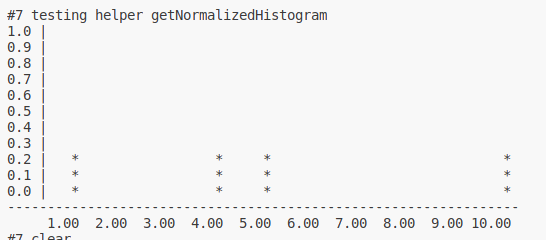

# GoodMorningExercise

## Guide

1. Clone the repositry to your local path
2. In your local path, compile and build the code by
   ```
        make
   ```
3. You should see comiled C++ files and also a binary executable file named "UnitTest.out". You could have a try by
   ```
        ./UnitTest.out
   ```

## Design


The design is following OOP pattern and also divide and conquer thinking.

StatiscalCalculator is a interface for easier future expansion, and URIStatiscalHelper is my implementation to handle the current task I am facing, focusing on double values. It's available for reusing and easy to understand, thus takes no effort to edit in the future.

StatiscalRequest is the child class of original Request class and it augmented the parent by providing statiscal calculation thanks to URIStatiscalHelper. For each URI it handled, there is one helper to calculate the information needed.

## Some explanation

Since only standard library is allowed, printing histogram has limited functionality. I'd like to clarify one thing about the histogram I printed.



Take this histogram as example, each * means that the data frequency is greater than or equal to the according scale. take bin 1.00 as example, this histogram shows that the frequency of the data from 0(not included) to 1.00 (included) has frequency x where <mark>0.2<=x<0.3</mark>

Take bin 2.00 as example, it means that the frequency of the data from 1.00(not included) to 2.00(included) is 0, since there's no * in the column.

